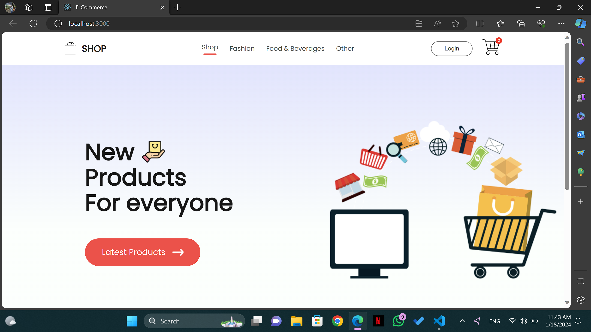
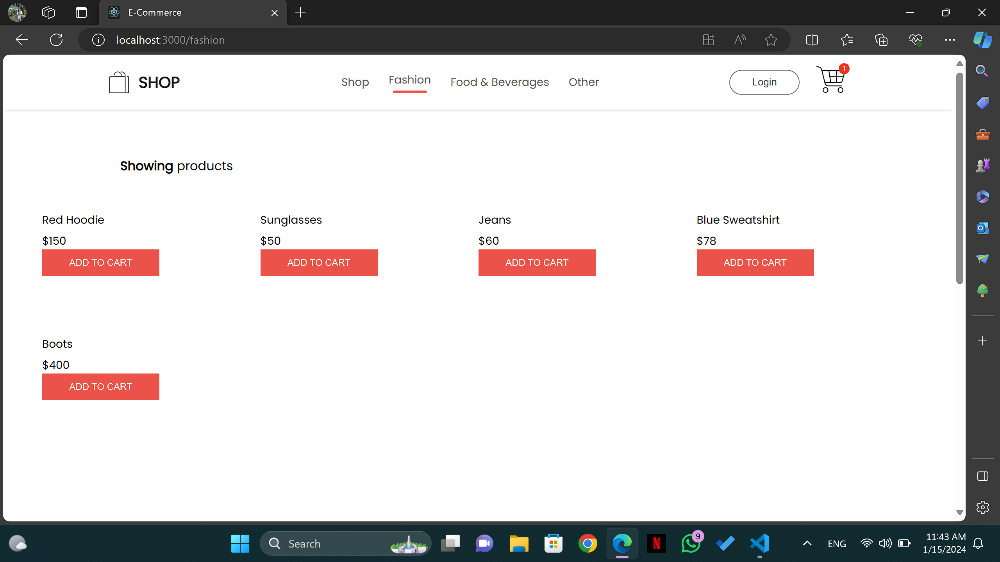
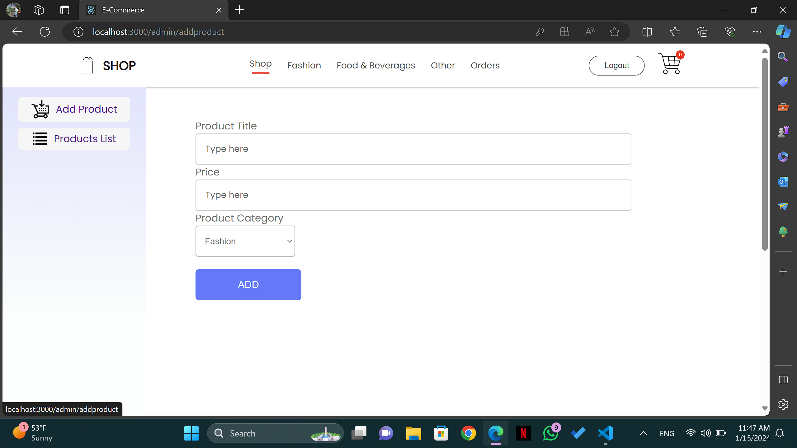
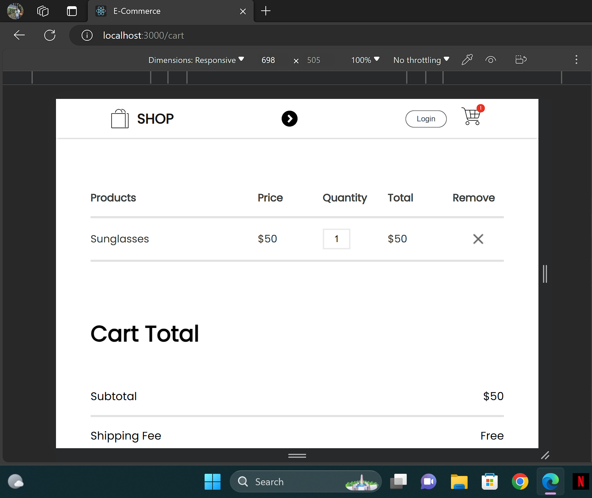
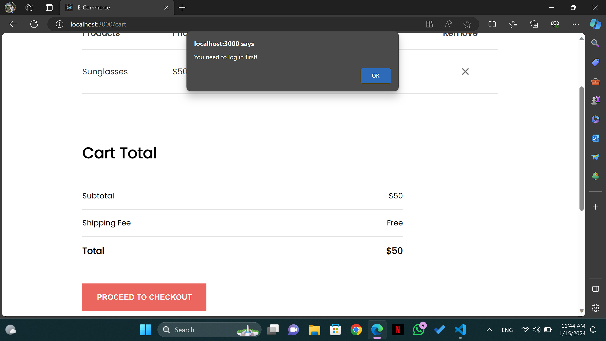

# E-Commerce Order Dashboard

The task is to develop a full-stack e-commerce order dashboard that retrieves order and product data from two different MongoDB collections, displays order summaries, and allows order modifications with specific rules.



<table>
  <tr>
    <td></td>
    <td></td>
  </tr>
  <tr>
    <td></td>
    <td></td>
  </tr>
</table>


## Table of Contents
  - [Description](#description)
  - [Features](#features)
  - [Non Functional Requirements](#non-functional-requirements)
  - [Technologies Used](#technologies-used)
  - [Installation](#installation)

## Description

This project is a full-stack e-commerce order dashboard designed to streamline the management of orders in an e-commerce platform. The system retrieves data from two MongoDB collections: one for orders and another for products. It provides a user-friendly interface for viewing order summaries. It also shows all products available in MongoDB where a user can add items to their cart and create orders based on selected preferences. Admins can add products and view a list of all product details.

## Features

- Sign up and Log in with user authentication.
- Retrieve and display order data from MongoDB collections.
- Display order summaries with relevant details.
- Filter orders based on two attributes: Date interval, price range.
- Allow logged in users/guests to delete orders with specific rule enforcement.
- Retrieve and display product data from MongoDB collections.
- Add products to cart, calculate cart sum, checkout to create your order.
- Allow authorized users (admins) to add products, remove products, and view full product list.

## Non Functional Requirements

- Completely Responsive User Interface
- Each Entity is represented by a Model Schema (User (extra), Product, Order)
- Real Time Updates to the database

## Technologies Used

- [React.js](https://reactjs.org/): A JavaScript library for building user interfaces. Used for creating dynamic and interactive components on the frontend.
- [Node.js](https://nodejs.org/en/): A JavaScript runtime that allows executing server-side code. Used for building the backend server.
- [Express.js](https://expressjs.com/): A minimalist web application framework for Node.js. Used for building RESTful APIs and handling server-side logic.
- [MongoDB Atlas](https://www.mongodb.com/cloud/atlas): A cloud-based MongoDB database service. Used for storing and retrieving data.
- [Cascading Style Sheets (CSS)](https://www.w3schools.com/css): Used for styling the user interface, ensuring a visually appealing presentation.
- [Material UI](https://material-ui.com/): A React UI framework that provides pre-designed components for a consistent and modern look and feel.
- [Redux](https://redux.js.org/): A predictable state container for managing the state of your application in a predictable way. Used for state management 			          in React applications.

## Installation

Follow these steps to set up the project:

```bash
# Clone the repository
git clone https://github.com/maryam-2000/e-commerce-dashboard.git

# Navigate to the project directory
cd e-commerce-dashboard

# Install dependencies for backend & frontend
cd backend
npm install
cd frontend
npm install

# Create a .env file in your backend directory and add the following variables
MONGODB_URI = your mongodb uri
PORT = 4000

# Now you are ready to start your app using the following commands
## Start the server in a new integrated terminal
cd backend
node ./src/index.js

## Start the client side app in another integrated terminal
cd frontend
npm start

# Finally, open your browser and go to `https://localhost:3000`
